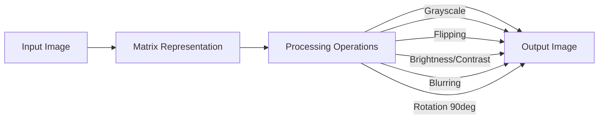

# 📸 Digital Image Processing with Matrices  

  
  
  
  

A **C++ implementation of Digital Image Processing** using matrix operations on `.ppm` images.  
This project was developed as part of the **FuzeTek Summer Internship 2025 (Project 5)** to practice **Object-Oriented Programming (OOP)**, file handling, and applying **linear algebra concepts** in real-world computer vision tasks.  

---

## 🔹 Overview  

Images are represented as **numerical pixel matrices** in the **Portable Pixmap (PPM) format**, enabling direct manipulation of RGB values without external libraries.  
By applying **mathematical operations** on these matrices, the project demonstrates fundamental image transformations while reinforcing the connection between **mathematics, programming, and computer vision**.  

---

## 🚀 Key Features  

- ✅ **Grayscale Conversion** → Convert RGB images into single-channel grayscale  
- ✅ **Horizontal & Vertical Flipping** → Mirror images through pixel re-indexing  
- ✅ **Brightness Adjustment** → Modify pixel intensity with clamping (0–255)  
- ✅ **Contrast Adjustment** → Enhance or reduce contrast by scaling around midpoint  
- ✅ **Blurring** → Apply a 3×3 averaging filter for smoothing  
- ✅ **Rotation (90°)** → Rotate images clockwise using matrix transposition  
- ✅ **PPM File Handling** → Load and save `.ppm` images with pixel-level control  
- ✅ **Test Image Generator** → Programmatically create a 4×4 test image for validation  

---

## 📂 Technical Highlights  

| Aspect              | Details |
|---------------------|---------|
| **Language**        | C++ |
| **Representation**  | 3D Matrix `[height][width][channels]` |
| **Format**          | PPM (P3 – plain text RGB) |
| **Core Class**      | `Image` – manages pixel storage, file I/O, and transformations |
| **Outputs**         | Processed `.ppm` images, viewable directly or convertible to PNG/JPEG |

---

## 🖼️ Workflow  



---

## 📖 Example Usage  

1. **Compile the project:**  
   ```bash
   g++ -o image_processing DIP.cpp
   ```  

2. **Run the executable:**  
   ```bash
   ./image_processing
   ```  

3. **Generated outputs include:**  
   - `gray_image.ppm`  
   - `flipped_horizontal.ppm`  
   - `flipped_vertical.ppm`  
   - `bright_image.ppm`  
   - `contrast_image.ppm`  
   - `blurred_image.ppm`  
   - `rotated90_image.ppm`  

---

## 📑 Applications  

Matrix-based image processing underpins a wide range of fields:  

- 🖼 **Computer Vision** → Preprocessing for object detection, recognition, and classification  
- 📷 **Photography & Media** → Image corrections, filtering, and creative enhancements  
- 🧪 **Medical Imaging** → Improved clarity in X-rays, MRIs, and CT scans  
- 🎨 **Graphics & Design** → Digital art creation, editing, and effects pipelines  
- 🤖 **Artificial Intelligence** → Data preprocessing for deep learning models  
- 🛰 **Remote Sensing** → Satellite image analysis and environmental monitoring  
- 🎮 **Game Development** → Texture manipulation and visual rendering  

---

## 🎯 Learning Outcomes  

- Representing images as **mathematical matrices**  
- Applying **matrix operations** for real-world transformations  
- Strengthening skills in **C++ OOP, algorithms, and file handling**  
- Gaining foundational knowledge in **computer vision and image analysis**  

---

## 🔮 Future Enhancements  

- Edge detection (Sobel, Prewitt filters)  
- Arbitrary angle rotation and image scaling  
- Cropping and region-of-interest processing  
- Advanced color effects (negative, sepia, channel isolation)  
- Broader format support (PNG, JPEG)  

---

## 🤝 Credits  

Developed by **Team 4** during the  
**FuzeTek Summer Internship 2025 – Project 5: Digital Image Processing with Matrices**  

**Team Members:**  
- Sondos Ahmed (Leader)  
- Ahmed Abdelrasoul  
- Alaa Tarek  
- Khaled Bishr  
- Muhammed Albahagy  

---

💫 This project illustrates the integration of **mathematics, programming, and digital imaging**, serving as both a learning tool and a foundation for further exploration in **computer vision, AI, and digital signal processing**.
